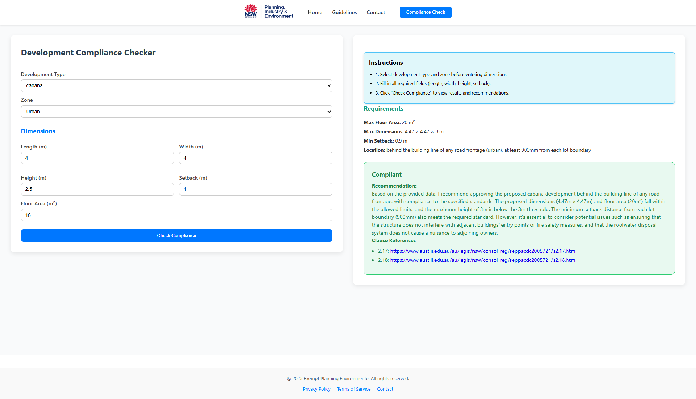

# == EDIT FROM HONDAGUYVTEC ==
This repository is a fork of the `Exempt_development_frontend` repository by `haseebah2003-blip`. I have merged my backend rule-checking logic with the frontend interface and can confirm that it is all working. I have also removed redundancies such as any server requests that were previously being made to an external backend rule checker algorithm, as this is no longer necessary.

To run this, simply clone this (forked) repository in VS Code by typing the command `git clone https://github.com/HondaGuyVTEC/Exempt_Development_Checker_Merged.git`, then type `npm run dev`.
# Exempt Development Frontend
  


Frontend for the **Exempt Development** project.  
Lightweight interface for managing and testing exempt development workflows.  


## 🚀 Getting Started

Follow these steps to set up the project locally.

### Prerequisites
- Node.js (>= 18)
- npm or yarn

## First setup backend to setup follow this process 
[](https://github.com/haseebah2003-blip/Exempt_development_backend.git)
### Installation
```bash
# Clone the repository
git clone https://github.com/haseebah2003-blip/Exempt_development_frontend.git

# Navigate to project directory
cd Exempt_development_frontend

# Install dependencies
npm install
# or
yarn install
## Start project
npm run dev
```
# User Interface

  
