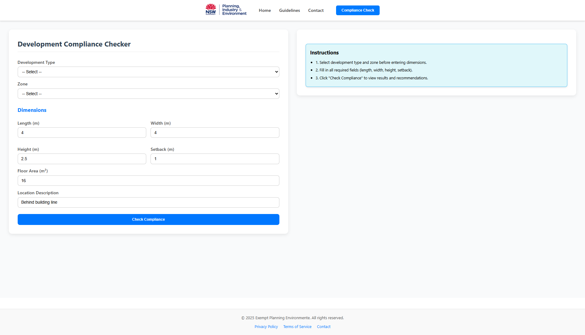

# Exempt Development Frontend

  

Frontend for the **Exempt Development** project.  
Lightweight interface for managing and testing exempt development workflows.  


## 🚀 Getting Started

Follow these steps to set up the project locally.

### Prerequisites
- Node.js (>= 18)
- npm or yarn

### Installation
```bash
# Clone the repository
git clone https://github.com/haseebah2003-blip/Exempt_development_frontend.git

# Navigate to project directory
cd Exempt_development_frontend

# Install dependencies
npm install
# or
yarn install
